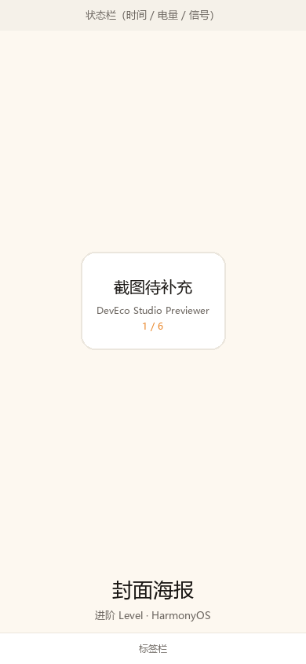
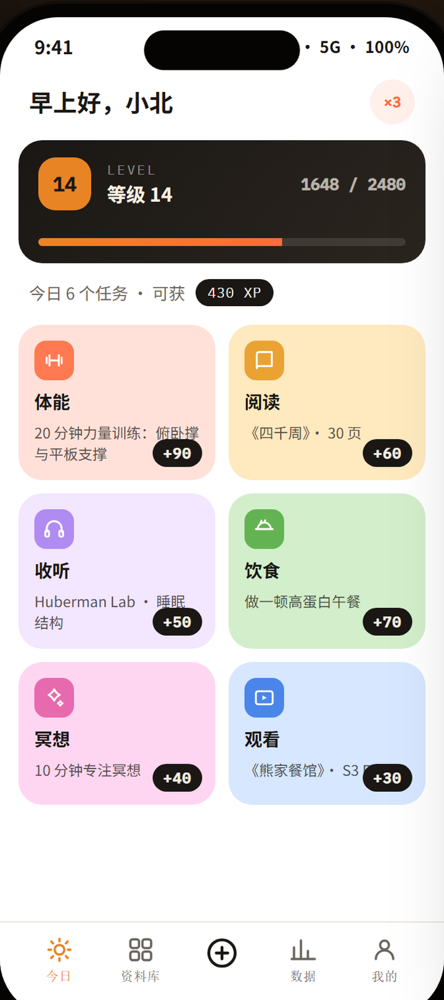
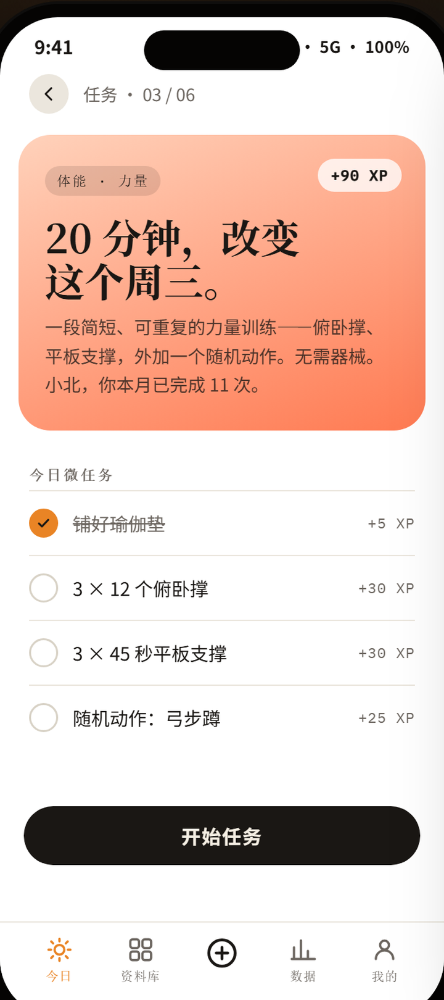
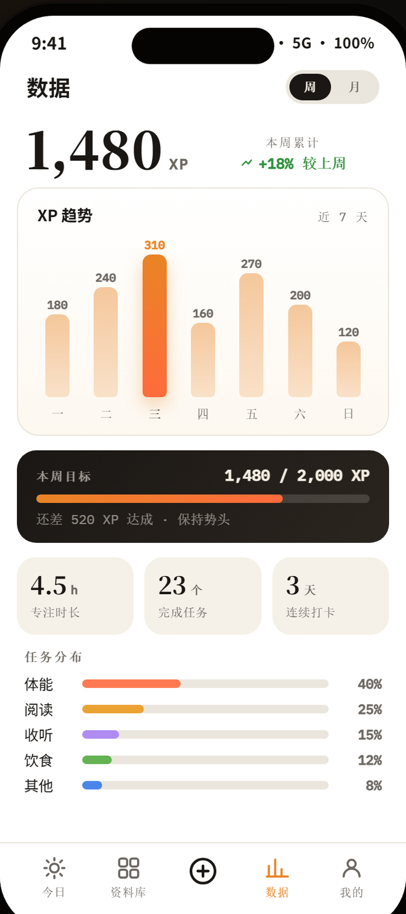

<p align="right">
  <strong>简体中文</strong> · <a href="README.en.md">English</a>
</p>

<h1 align="center">LevelUp</h1>

<p align="center">
  <strong>进阶 Level ——「每日任务，成为更好的自己」</strong><br>
  一个用 <strong>HarmonyOS NEXT 原生</strong>技术栈（ArkTS + ArkUI）写的每日任务 App，数据全部留在本机。
</p>

<p align="center">
  <a href="https://github.com/montersy123/levelup-harmonyos/stargazers"></a>
  <a href="LICENSE"></a>
  
  
  
</p>

<p align="center">
  
  
</p>
<p align="center">
  
  
</p>

`LevelUp` 是一个**纯本地的每日任务 / 打卡 App**：接微任务、攒经验值、看自己的等级与数据趋势。
它整个用 **HarmonyOS NEXT 原生**技术栈写成 —— 没有一行 Web 代码，不联网、不上传、不需要账号。
界面的色值、字号、圆角、动效全部收在具名令牌里，组件不写死，也不套用系统默认主题色或默认字体。

- **四屏还原** —— 封面海报 / 今日任务 / 任务详情 / 数据统计，外加按同一套 token 补齐的「资料库」「我的」；底部标签栏 5 个槽位全部可点。
- **打卡与成长** —— 微任务逐项勾选、单任务一键完成；经验值累计、等级换算、等级内进度条、连续打卡天数。
- **数据统计** —— 周 / 月分段、XP 柱状图（点住或悬停出明细 tooltip）、周目标、三宫格、任务分布，全部按真实打卡记录**现算**，不存派生值。
- **数据只在这台手机上** —— 用 `@kit.ArkData` 的 Preferences 存在应用私有目录，不联网、不上传、无账号、无遥测、无第三方 SDK。
- **视觉令牌化** —— 颜色 / 字号 / 间距 / 圆角 / 动效全部冻结在 [Theme.ets](entry/src/main/ets/common/Theme.ets)，组件里不写死色值。
- **响应式** —— 手机等比铺满，平板 / 折叠屏内容限宽 680vp 居中，任务卡网格在 2 / 3 / 4 列之间切换。

## 快速开始

### 环境要求

| 项 | 本工程使用 |
|---|---|
| DevEco Studio | 5.0 及以上（本工程在 DevEco Studio 下同步、编译通过） |
| HarmonyOS SDK | API 26（platformVersion 26.0.0.105） |
| hvigor | 6.26.8（随 DevEco Studio 附带） |
| 编译目标 | `compatibleSdkVersion: 5.0.0(12)`，`runtimeOS: HarmonyOS` |
| 目标设备 | 手机 / 折叠屏 / 平板（`deviceTypes: phone, tablet, 2in1`） |
| 构建产物 | `entry/build/default/outputs/default/entry-default-unsigned.hap` |

**当前编译状态**：`COMPILE RESULT` 无 ERROR，`BUILD SUCCESSFUL`，产物约 488 KB。
仅剩 1 条提示性告警（`Prefs.ets` 里 `getPreferences` 可能抛异常）—— 该调用在 `AppStore.init` 中已被
`try/catch` 兜住，属于编译器无法跨函数看到的那一层保证。

### 用 DevEco Studio 跑起来

1. **File → Open**，选择本目录（含 `oh-package.json5` 的那一层）。
2. 等待 **Sync Now** 完成。
3. **File → Project Structure → Signing Configs** 勾选 **Automatically generate signature**（需登录华为账号）。
   - 命令行已能产出**未签名** HAP；要装到真机上必须再配签名。
   - `build-profile.json5` 里 `products[0].signingConfig` 指向名为 `default` 的签名配置；
     若你用的是别的名字，改这一行，或删掉这一行让 DevEco Studio 自动接管。
4. 连接真机或启动模拟器，点击 **Run**。

### 命令行构建

```powershell
# 按你机器上的安装路径改这两行
$env:DEVECO_SDK_HOME = 'D:\Program Files\Huawei\DevEco Studio\sdk'
$node = 'D:\Program Files\Huawei\DevEco Studio\tools\node\node.exe'
$w    = 'D:\Program Files\Huawei\DevEco Studio\tools\hvigor\bin\hvigorw.js'

# 编译
& $node $w --mode module -p product=default -p module=entry@default assembleHap --no-daemon

# 清理
& $node $w clean --no-daemon
```

`local.properties` 记录本机的 `sdk.dir` 与 `nodejs.dir`，且已在 `.gitignore` 中忽略；
换机器时改成你自己的路径，或直接删掉让 DevEco Studio 重新生成。

### 静态自检（不需要 DevEco Studio）

```powershell
node tools/validate.js
```

零依赖，用 Node 直接跑。它检查 6 项：JSON / JSON5 能否解析、`$r()` 引用的资源是否都存在、
`.ets` 之间的 import 能否解析且符号确有导出、主题令牌是否拼错、**是否存在「调用了不存在的静态成员」**、
`module.json5` / `main_pages.json` 声明的文件是否真实存在。当前结果：**错误 0，警告 0**。

> 第 5 项是为这个工程专门加的：在没有编译器的环境里，
> 「删掉了某个方法、但别处还在调用」是最隐蔽的一类错误。它会跨全部 `.ets` 交叉校验 198 个静态成员。

## 页面与组件

每个页面与可复用组件，以及它们的实现位置：

| 页面 / 组件 | 实现位置 | 说明 |
|---|---|---|
| 封面海报 | [CoverView.ets](entry/src/main/ets/view/CoverView.ets) | 深色海报，「进入今日任务」的入口 |
| 今日任务 | [HomeView.ets](entry/src/main/ets/view/HomeView.ets) | 问候语 + 连续打卡 + 等级丝带 + 6 张任务卡 |
| 等级丝带 | [LevelRibbon.ets](entry/src/main/ets/view/LevelRibbon.ets) | 进度条按真实 XP 计算，并带 `fillbar` 生长动画 |
| 任务卡 / 网格 | [QuestGrid.ets](entry/src/main/ets/view/QuestGrid.ets) / [QuestCard.ets](entry/src/main/ets/view/QuestCard.ets) | 卡片底色与图标底色逐条对应 `--tile-*` |
| 任务详情 | [DetailView.ets](entry/src/main/ets/view/DetailView.ets) | 渐变 Hero、绝对定位 XP 印章、微任务清单、CTA |
| 数据统计 | [StatsView.ets](entry/src/main/ets/view/StatsView.ets) | 周 / 月分段、汇总、目标卡、三宫格、任务分布 |
| XP 图表 | [XpChart.ets](entry/src/main/ets/view/XpChart.ets) | 柱高按当期最大值归一化；`getRectangleById` 读真实布局反算 tooltip 位置，含边界夹取与 `.below` 翻转 |
| 资料库 / 我的 | [LibraryView.ets](entry/src/main/ets/view/LibraryView.ets) / [MeView.ets](entry/src/main/ets/view/MeView.ets) | 任务全目录与本地存储说明；身份区、等级、累计经验、数据管理 |
| 底部标签栏 | [TabBar.ets](entry/src/main/ets/view/TabBar.ets) | 5 槽：今日 / 资料库 / ＋ / 数据 / 我的 |
| 主题令牌 | [Theme.ets](entry/src/main/ets/common/Theme.ets) | 颜色 / 字号 / 间距 / 圆角 / 动效全部具名，组件不写死色值 |

### 补充页：资料库与我的

资料库与我的和其余页面共用同一套令牌，标签栏 5 个槽位全部可点、不报错：

- **资料库**：任务全目录 + 本地存储说明。
- **我的**：身份区、等级、累计经验、分类累计、数据管理（清空 / 恢复演示数据）。
- **＋（中间按钮）**：弹出「新建任务」底部弹层 —— 因为该功能暂不做，这里明确告知用户。

## 目录结构

```
LevelUp/
├─ AppScope/
│  ├─ app.json5                    应用级配置（bundleName / 版本 / 图标 / 名称）
│  └─ resources/base/element/      应用级字符串
├─ entry/                          主模块
│  ├─ build-profile.json5          模块构建配置
│  ├─ src/main/
│  │  ├─ module.json5              模块与 EntryAbility 声明
│  │  ├─ resources/base/
│  │  │  ├─ element/               字符串、颜色
│  │  │  ├─ media/                 图标（SVG 可着色 + 分层图标 PNG）
│  │  │  └─ profile/main_pages.json
│  │  └─ ets/
│  │     ├─ entryability/EntryAbility.ets   启动、沉浸式、初始化本地存储
│  │     ├─ pages/Index.ets                 唯一的 @Entry，路由 + 新建任务弹层
│  │     ├─ common/
│  │     │  ├─ Theme.ets          ★ 视觉令牌（颜色/字号/间距/圆角/动效/布局）
│  │     │  ├─ Prefs.ets          ★ 本地存储封装（Preferences）
│  │     │  └─ Format.ets         千分位等纯函数
│  │     ├─ model/Quest.ets       领域模型与枚举
│  │     ├─ data/Data.ets         任务目录 + 演示数据
│  │     ├─ store/AppStore.ets    ★ 状态中心 + 派生指标 + 落盘
│  │     └─ view/
│  │        ├─ CoverView.ets      屏 1 · 封面海报
│  │        ├─ HomeView.ets       屏 2 · 今日任务
│  │        ├─ DetailView.ets     屏 3 · 任务详情
│  │        ├─ StatsView.ets      屏 4 · 数据统计
│  │        ├─ LibraryView.ets    补充页 · 资料库
│  │        ├─ MeView.ets         补充页 · 我的
│  │        ├─ LevelRibbon.ets    等级丝带（复用组件）
│  │        ├─ QuestCard.ets      任务卡（复用组件）
│  │        ├─ QuestGrid.ets      任务卡网格（2/3/4 列自适应）
│  │        ├─ XpChart.ets        XP 柱状图 + 悬浮明细 tooltip
│  │        ├─ TabBar.ets         底部 5 槽标签栏
│  │        └─ Chip.ets           胶囊标签
│  └─ src/ohosTest/                测试模块骨架
├─ docs/
│  ├─ design-full.png              截图源图
│  └─ screenshots/                 裁好的四张界面图
└─ tools/
   ├─ validate.js                  工程静态校验
   ├─ design_shot_geom.py          推导单屏裁切坐标
   ├─ crop_design_shots.py         从整页源图裁出单屏
   ├─ gen_ui_icons.py              生成 UI 图标
   └─ gen_icons.py                 生成应用图标
```

## 数据与本地存储

全部状态用 `@kit.ArkData` 的 **Preferences** 存在应用私有目录，键值如下：

| 键 | 类型 | 含义 |
|---|---|---|
| `totalXp` | number | 累计经验值，等级由它反推 |
| `streak` | number | 连续打卡天数 |
| `streakDate` | string | 最后一次给连续天数计分的日期，保证每天最多 +1 |
| `days` | string（JSON） | `{"2026-02-18": {"steps": ["body-1", ...]}}`，按日期归档的完成记录 |
| `unlocked` | boolean | 是否已看过封面（决定冷启动落哪一页） |
| `seedDay` / `version` | number | 首次安装播种标记、数据版本号 |

想彻底清空，用「我的 → 清空全部本地数据」，或卸载应用 —— 数据没有第二份副本，也不会离开这台设备。

### AppStorage 里只放不可变值（重要）

界面刷新靠 `@StorageLink` 观察 `AppStorage`。**ArkUI 观察不到嵌套对象的深层改动**，
所以打卡记录以 **JSON 字符串** 的形式存在 `AppStore.K_DAYS_JSON`，
每次改动都会生成一个新字符串，订阅它的组件才会重绘。

早期版本把 `days` 当作对象存进去、再原地改字段，结果就是
**勾选微任务后界面毫无反应，退出页面再进来才显示勾选状态**。

为了彻底避开这个问题，**界面显示所需的每一种状态都额外做了一份字符串镜像**，
视图只订阅镜像、业务方法仍读写原始值：

| 镜像键 | 内容 | 谁在用 |
|---|---|---|
| `doneSteps` | 今日已完成步骤 id，逗号分隔 | 详情页、任务卡、资料库 |
| `earnedXpStr` / `readyXpStr` | 今日已获 / 还可获得的 XP | 详情页、首页副标题 |
| `totalXpStr` | 累计 XP | 「我的」页 |
| `streakStr` | 连续打卡天数 | 页面头部角标、「我的」页 |
| `loggedDays` | 有打卡记录的天数 | 「我的」页 |

任何会改变可见状态的操作，最后都必须调用 `AppStore.refreshMirrors()` —— 它已包含在
`commit()` / `clearAll()` / `restoreSeed()` / `init()` / `bind()` 里。

### 界面刷新机制（踩过坑，务必先读）

这一块改过好几版，最终结论是：

> **在这个工程里，`@State` 的局部重绘可靠；跨组件的 AppStorage 变更通知不可靠。**

踩过的坑，按时间顺序：

1. `days` 以**嵌套对象**存进 `AppStorage`、再原地改字段。
   ArkUI 观察不到深层改动 → **勾选微任务后界面毫无反应，退出重进才显示**。
   → 改成 JSON 字符串（每次都是新值）。
2. 仍然不行 → 又给每种显示状态加了**字符串镜像**（`doneSteps`、`earnedXpStr`…），
   视图只订阅镜像。
3. 仍然不行（清空数据后要切页再回来）→ 又加了**数据修订号** `dataRev`，
   根组件订阅后下发给各页，靠父组件重绘带动子树，甚至让路由分支
   依赖它来**强制重建**整个页面。
4. **最终有效方案（当前实现）**：
   - 数值**现读**：`AppStore.persistedXp()` / `persistedStreak()` 直接读本地存储，
     绕开 `AppStorage`，避免读到自己写过的过期镜像。
   - 数据变更的动作（清空 / 恢复）里，直接把一个纯 `@State` 计数
     `refreshTick` 加一；并让 `refreshTick` **直接出现在 `build` 的条件里**，
     保证它在依赖链上。
   - `LevelRibbon` 是独立组件，不会随父组件重绘，因此单独接收 `tick` 参数，
     并在 `onDidBuild` 里同步进度条。

一句话：**「点一下局部状态 → 整页重算」，不经过任何跨组件通道。**

保留的字符串镜像（`doneSteps` 等）仍然在用：详情页、任务卡、资料库订阅它们来渲染
勾选状态 —— 那条路径是有效的（打卡的实时反馈也是好的）。

### 数据规则

- **只存原始数据，派生指标一律现算**。今日进度、等级进度条、周 / 月统计、
  任务分布占比都由 `AppStore` 从 `days` + 任务目录算出来，
  所以任何一处打卡会让首页、详情页、数据页同时刷新，不会出现数据不一致。
- **XP 只加不退**：首次从未完成变为完成时加分；取消勾选不回退，避免负余额和反复刷分。
- **数值自洽**：初始数值（等级 14 / 1648 / 2480）保持不动；
  统计页把内置的周数据当作「今天之前的基线」，**今天那根柱子 =
  基线 310 XP + 今天真实打卡所得**。这样首屏周累计仍是 1,480，
  同时打卡又会实时把柱子和汇总推高，两处数字始终对得上。
- **跨天处理**：`onForeground` 会刷新「今天」的日期键，App 在后台过夜后仍落在正确的一天。
- **版本迁移**：`version` 变化只重置打卡记录（`days`），
  **绝不动用户已经攒下的经验值**——这一点在早期实现里写错过，已修正。
- 首次启动会写入初始数值；「我的 → 恢复演示数据」可随时还原。

## 视觉实现说明

### 字体：统一使用系统字体

界面用到衬线、无衬线、等宽三种字体族。鸿蒙设备不预装 `Noto Serif SC` / `Noto Sans SC` / `IBM Plex Mono`，
且离线 App 不应依赖在线字体，因此
[Theme.ets](entry/src/main/ets/common/Theme.ets) 的 `Font` 类把三族都指向系统自带的
**HarmonyOS Sans**，并保留常见字体名作为回退：

```
serif: HarmonyOS Sans SC, Noto Serif SC, serif
sans : HarmonyOS Sans SC, Noto Sans SC, sans-serif
mono : HarmonyOS Sans SC, IBM Plex Mono, monospace
```

如果你希望换成衬线 / 等宽字体，把这三款字体的 `.ttf` 放进
`entry/src/main/resources/rawfile/`，然后在 `EntryAbility.onWindowStageCreate` 里用
`font.registerFont()` 注册，再把 `Font` 里的名字改成注册名即可。

### 视觉令牌

- **色值**：`--stage #0e0d0c`、`--ink #1a1714`、`--accent #e98425`、`--accent-2 #ff6b3d`、
  `--tile-1…6`、`--line #ebe6dd`、`--muted #6c6660` 等逐个落到 `Color` 类。
- **字号**：`54/42/30/18/15/14.5/14/13.5/12.5/11/10.5/10/9.5` 全部收录在 `FontSize`。
- **间距**：`2…40` 收录在 `Space`，卡片外边距 14、页面内边距 22。
- **圆角**：任务卡 / 图表卡 18、Hero 24、丝带 18、胶囊 999 等收录在 `Radius`。
- **动效**：`fillbar .7s`、`grow .6s`、`transition .15s`、tooltip `.16s` 收录在 `Motion`，
  用 `animateTo` 实现；系统开启「减少动态效果」时 ArkUI 会自动缩短时长。
- **状态**：hover（`HoverEffect`）、按下、focus、空状态、tooltip 均已覆盖；
  加载 / 错误态在纯本地数据下不会出现，故未伪造。
- **文案与数值**：问候语、任务标题副标题、微任务步骤与 XP、周一到周日的 XP 柱值
  （180/240/310/160/270/200/120）、本周目标 1480/2000、三宫格数值都已内置为演示数据。

### 响应式

从 360 起的 9 档视口都有对应表现。实现上没有做多套布局，而是：

- 手机（≤680vp）等比铺满；
- 平板 / 折叠屏展开时内容限宽 680vp 并居中（`constraintSize({ maxWidth })`）；
- 任务卡网格按宽度在 **2 / 3 / 4 列**之间切换；
- 标题在宽屏（对应 1200px 断点）从 54 缩到 46。

## 路线图

**已完成（UI + 本地数据）**

- 4 个主页面全部实现为原生页面，标签栏 5 个入口全部可用
- 微任务勾选打卡、单任务一键完成、取消勾选
- 经验值累计、等级换算、等级内进度条
- 连续打卡天数
- 数据页：周 / 月切换、XP 趋势图、触摸 / 悬停明细 tooltip、周目标、三宫格、任务分布（按真实数据计算）
- 本地持久化 + 冷启动恢复 + 跨天处理
- 数据管理：清空本地数据、恢复演示数据（「我的」页）

**未完成（有意留白）**

- 新建 / 编辑 / 删除自定义任务（中间 ＋ 按钮目前是说明性弹层）
- 任务提醒、通知、系统日历集成
- 账号、云同步、多设备
- 月视图的精确数据（目前是按周数据等比放大的一档演示数据）
- 桌面卡片 / 服务卡片（本期不做）

欢迎就上面任何一条提 issue 或 PR —— 尤其是自定义任务这一块，`AppStore` 与 `Data.ets` 已经预留了数据结构。

## 验收清单

在 DevEco Studio 里跑起来之后，建议按这个顺序过一遍：

1. **首屏**：全新安装 → 深色封面海报，标题里「更好的自己」是橙色。
2. **进入今日**：点底部的「进入今日任务」→ 页面流畅切换。
3. **等级丝带**：等级 14、`1648 / 2480`、进度条约 66%。
4. **任务卡**：6 张卡、2 列、底色各不相同（体能橙红 / 阅读米黄 / 收听淡紫 / 饮食淡绿 / 冥想粉 / 观看淡蓝）。
5. **打卡**：点任意卡片进详情 → 勾选步骤，勾选圈变橙并出现对勾，文字加删除线，右侧变「已完成」。
6. **经验值**：返回首页，等级丝带的 `1648` 已增加；再进「数据」页，今天的柱子和汇总同步变化。
7. **tooltip**：数据页点住 / 悬停任意一根柱子，弹出深色明细卡；点最左、最右的柱子，卡片不会超出卡片边界。
8. **周 / 月切换**：切到「月」，柱数变 4、目标变 8000，进度条平滑过渡。
9. **持久化**：完全杀掉 App 再打开，**应当直接进入「今日」**且打卡记录还在。
10. **跨天**：把系统日期改到明天再打开，今日进度归零、昨天记录保留。
11. **空状态**：「我的」→ 清空全部本地数据 → 等级回到 1 级、进度归零，并回到封面。
12. **不同尺寸**：折叠屏展开 / 平板下，内容居中有最大宽度，任务卡变 3～4 列，无横向滚动。
13. **字体**：中文显示为 HarmonyOS Sans（非宋体 / 非默认衬线），数字为等宽观感。

## 重新生成图标与截图

三者都是脚本生成、可重复执行，依赖 **Python 3 + Pillow**（`pip install pillow`）：

```powershell
# 1) UI 图标（标签栏 / 返回 / 对勾 / 趋势 / 6 个分类图标）
python tools/gen_ui_icons.py
# 生成后可用 tools/icon_check/contact-sheet.png 一眼核对全部图标

# 2) 应用图标（app_icon / background / foreground / startIcon）
python tools/gen_icons.py

# 3) 界面图：从整页源图裁出四张单屏（读 docs/design-full.png）
python tools/crop_design_shots.py
python tools/crop_design_shots.py <别的整页渲染图>   # 换源图
```

裁屏脚本每屏输出两张：`01-cover.png`（仓库里收录的就是这一版，README 用的也是它）
与 `01-cover-full.png`（未收录，已在 `.gitignore` 里忽略）。

脚本里的路径都以仓库根目录为基准，在任何机器上克隆下来都能直接跑。

### 为什么图标是 PNG 而不是 SVG

这是本工程踩过的一个坑，写下来避免以后返工：

**鸿蒙的 `Image.fillColor` 只改「填充色」，对描边式 SVG 无效。**
用 `fill="none" + stroke="…"` 写的图标（圆环、加号、箭头这类线稿），
`fillColor` 不会给描边上色，而是把形状**整体填满** ——
圆环变成一个实心圆盘，加号糊成一团，底部标签栏中间的「＋」就变成了一个黑饼。

因为图标只有 24px、需要的外观也只有固定的几种颜色，
最省事也最可靠的做法是：**在 Python 里按需要的颜色直接画成 PNG**，
用 `fillColor` 的场景随之完全消失（工程里已经没有任何 `fillColor` 调用）。

每个图标在 4 倍尺寸上绘制再 LANCZOS 缩小，边缘平滑；
配色：`#1a1714`（墨）、`#6c6660`（muted）、`#e98425`（accent）。

标签栏的选中态没有用 `fillColor` 着色，而是准备了 `*_on.png`（橙）
与 `*.png`（灰）两套，按选中状态切换资源。

> 改配色时，改 `tools/gen_ui_icons.py` 顶部的颜色常量再跑一次即可。

## 参与贡献

Issue 和 PR 都欢迎。提交前请至少做到：

1. `node tools/validate.js` 通过（错误 0、警告 0）。
2. 在 DevEco Studio 里能 `BUILD SUCCESSFUL`，并按上面的验收清单过一遍受影响的项。
3. **新增界面不要写死色值 / 字号 / 间距** —— 一律加到 [Theme.ets](entry/src/main/ets/common/Theme.ets) 的令牌里再用，
   这是界面能保持视觉一致的原因。
4. 改可见状态时，注意上面「界面刷新机制」那一节：走 `AppStore` 的写入口，别绕过镜像与 `refreshTick`。
5. 文档改动请**同时更新 `README.md` 与 [README.en.md](README.en.md)**，两份内容保持一致。

## 许可

[MIT](LICENSE) © 2026 montersy123

本仓库的代码与文档以 MIT 协议开源：可以自由使用、修改、分发，包括商用，只需保留版权与许可声明。
